I've been meaning to write one of these for the past few years. It's easy to lose track of all the stuff I've worked on and completed and planned as the weeks and months blur past.

I often come skidding into the new year bewildered and wondering what happened these last 12 months – it was just January two minutes ago! – and now my back hurts and there's all this unfinished (and occasionally finished) crap hanging around on my hard drive. It's tough to be mindful of all the effort and struggle and work I've put into various projects and I find it easy to focus on the things I didn't do, the projects that I put on the back burner, the promises I broke, and the tasks I failed at. Instead of berating myself for not living up to some impossible ideal, I thought I'd try and celebrate the wins instead.

So, this is my attempt at doing that. A whistle-stop tour of what I've been up to this year and, at the end, what my plans for 2025 are.

## Achievements
### Submitted My PhD
This is what has consumed my life these past three years. When I signed up for this thing, I wasn't convinced I was capable of doing it. Imposter syndrome was biting down and I felt very out of my depth. The one thing I thought I had going for me was a commitment to give it everything I had. If I was going to put myself through the stress and struggle of doctoral research then, I told myself, I was going to have to commit. It sounds very 'motivational-poster' now I come to write it down, but as someone who has spent a lifetime half-arsing things out of fear of not being good enough (a self-fulfilling prophecy, that), deciding to fully commit was the only way I could see of me finishing the thing and being proud of what I'd done. Whether I pass or fail, at least I can say I gave it everything.

The downside of that is that the PhD consumed my life. Every waking moment, it felt like. I missed social events, made a hermit of myself, read a million books and articles and papers, and knocked a few years off my life through worry. I also composed 100+ etudes and fragments, wrote 30+ original songs, fully produced, mixed, and mastered 2 albums of original material and expanded my horizons as a musician and researcher immeasurably.

I've still got the Viva to navigate before I can officially call myself a doctor, but I'm pleased that the biggest part of it all is over.

### Slowly Finding an Audience
Despite me being so focused elsewhere these last few years, I've still been releasing the occasional video and song. And as such, there's been a little bit of growth in my audience across various social media. In the grand scheme of things, these numbers may seem small, but I'm incredibly grateful for every single person who took the time to listen or watch any of my stuff! There's much more to come in 2025. I try not to focus on the metrics for things like this too much, it's all out of my control and I'd be writing and releasing music regardless, but it is nice to see the number go up whenever I do let the anxiety win and check the figures:

- YouTube broke 100 subscribers (currently 116)
- Spotify reached 100 followers (currently 125)
- Facebook hit 200 followers (currently 204)
- Instagram: over 100 followers (currently 145)- 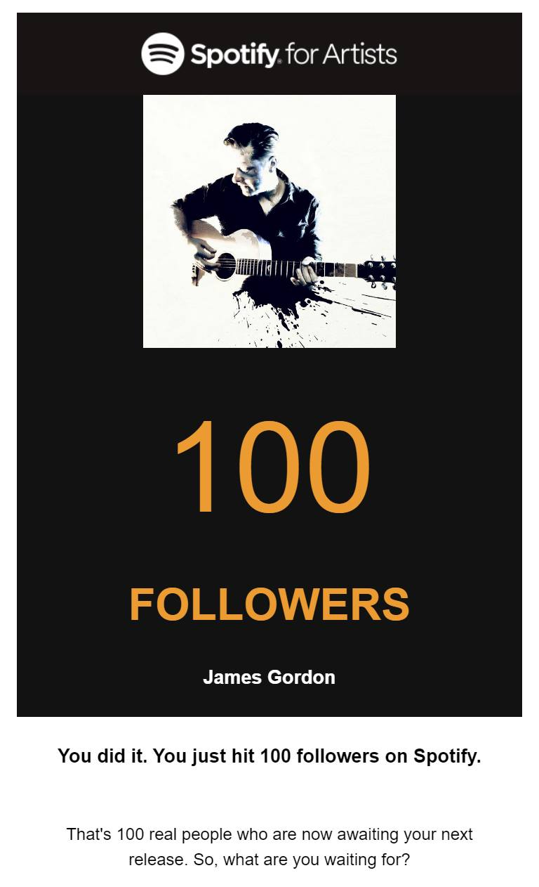
- Spotify 11k Streams
- 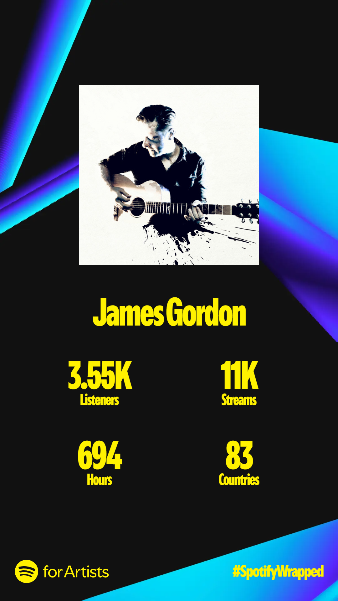
- Facebook: 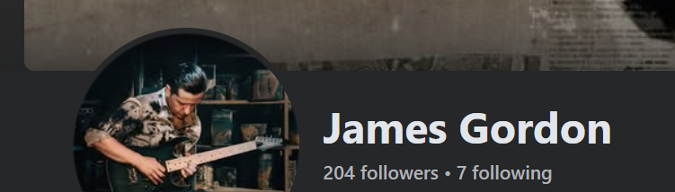
- Instagram 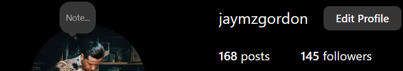

## Things I Made

### Mama, I'm Coming Home Video
My acoustic version of this Ozzy Osbourne classic. I'm really pleased with how the track turned out, the vocal harmonies and acoustic guitar solo are particular favourite parts, and the video ended up looking pretty good too.

- https://youtu.be/GCwkBKmjXzg?si=wP7ZjNtbGXqNobGm

### Nailed to My Heart Single
A throwback to the classic rock ballads I loved growing up, I was chuffed with how this one turned out. The vocal and production elements are all a little more polished and nuanced than some of my earlier work.

- https://jamesgordon.bandcamp.com/track/nailed-to-my-heart

### Nailed to My Heart Artwork
I always underestimate how long (and how much effort) it will take to put something together for the various streaming sites to show as artwork for each single I release. I'm not a huge fan of AI art generators (at least not in the way the final results look, they can be useful part of a seeking and inspiration process that you then iterate upon but-… more on that another day, that's a whole can of worms I don't have time for right now!) I'm pleased with how this turned out as it was a little less fantastical or design-focused and a little more personal (what with having my face on it). As always, I get nervous sharing this stuff as it's easy to becomes snow-blind (or snow-deaf for music stuff!) and lose track of whether it's any good or not.
- 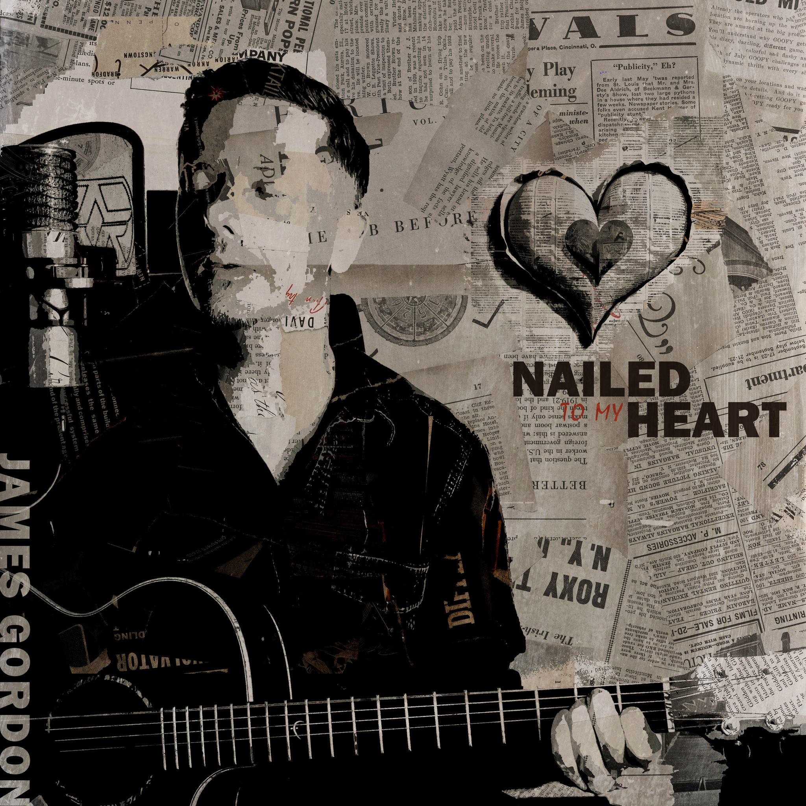

### Website Refresh
The website has been in dire need of a refresh for years. I spent some time cleaning things up, designing a new look and new branding (the tentacles in the logo are my favourite bit) and a new piece of main artwork to bring it all together. Given that my web design skills are about a decade or two out of date, I'm pretty pleased with how it all turned out. Take a look at jamesgordonmusic.com to see what I did.

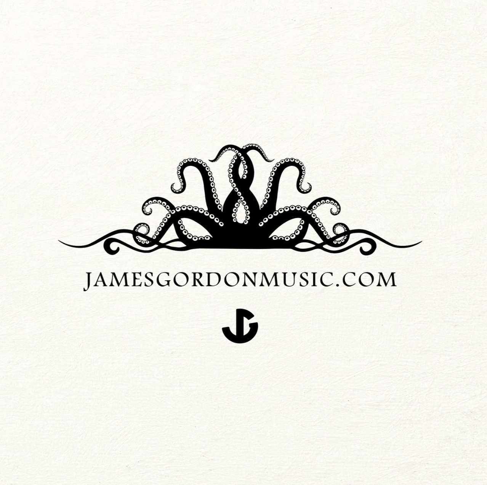
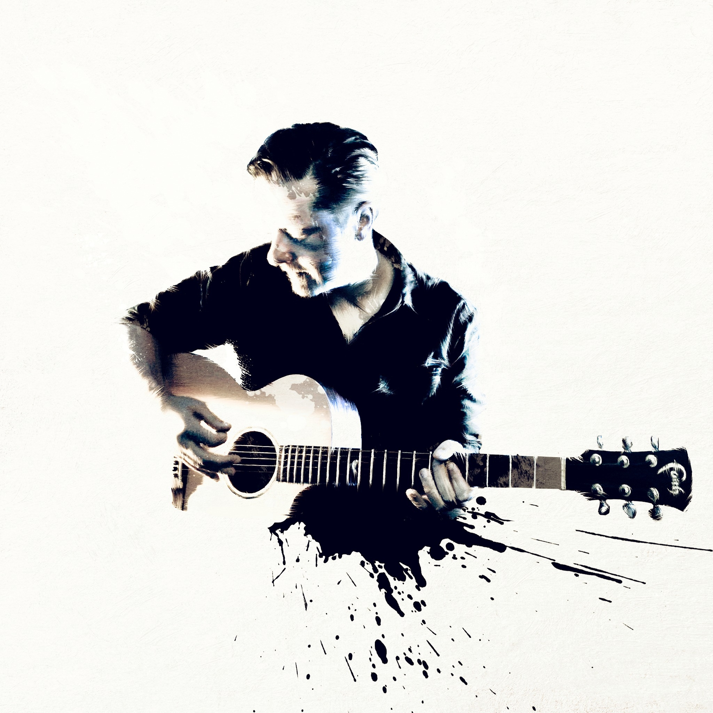

### PhD Albums 1 & 2 Artwork
I probably shouldn't be sharing these yet as the albums aren't going to be released for a while (see below). But I'm proud of how they turned out (and they took a massive amount of time and effort to finish) so I'm sharing them here. Also, I suspect there won't be many people reading through all of this long-winded, naval-gazing, self-aggrandisement, so it's unlikely they'll be a spoiler for anyone! :)

I think the two pieces of art do a great job of reflecting the themes I used on both of the albums (one focused on folk horror and the other on cosmic horror like Robert Chambers and H. P. Lovecraft). Feel free to guess which is which (and make a liar out of me by dropping a comment if you've read this far!)

A Mischief of Magpies album art
 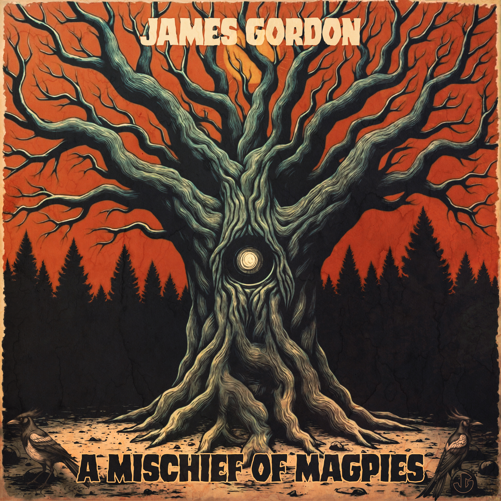
 A City of Rust and Bone album art
 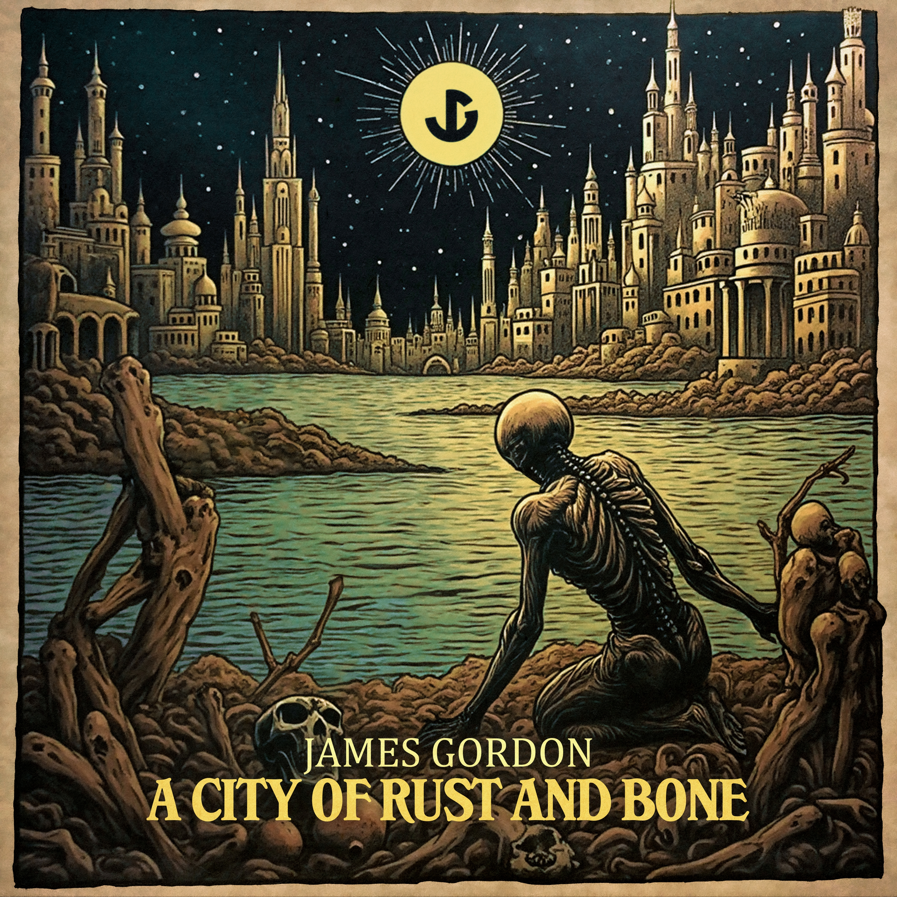

### The Composition Engine
More on this in the future. But this was the Creativity Support Tool I designed as part of my PhD research and it represents a metric tonne of reading, synthesising, and organising. I'll dig into the various parts and deep dive all of the research at some point (plus I want to build a much more user-friendly version), but I'm incredibly proud of all of the work that went into this, so here it is:

- https://sharecanvas.io/p/the-composition-engine
- https://jamesgordonmusic.com/the-composition-engine

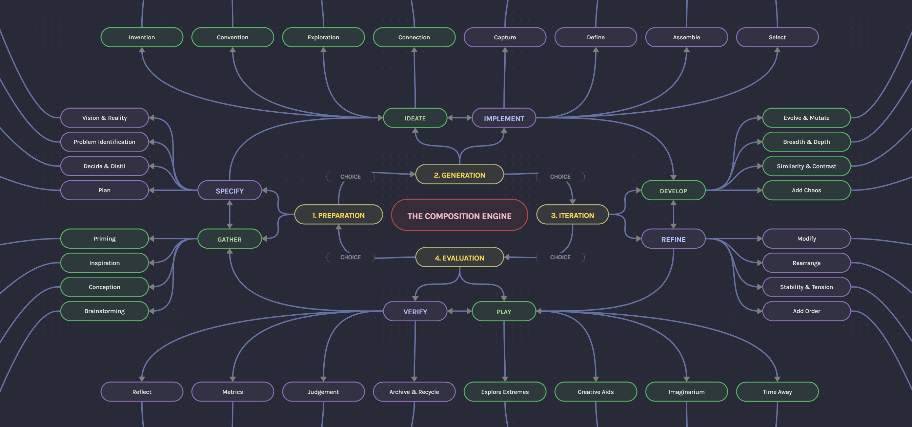
## Looking Forward to 2025

## Projects
### Sins Album
It's been 4 years since I promised to release this! I've been drip-feeding singles from the album out during that time (see [Candlelight | James Gordon](https://jamesgordon.bandcamp.com/track/candlelight), [Sin | James Gordon](https://jamesgordon.bandcamp.com/track/sin), [House of Broken Bones | James Gordon](https://jamesgordon.bandcamp.com/track/house-of-broken-bones), and [Nailed to My Heart | James Gordon](https://jamesgordon.bandcamp.com/track/nailed-to-my-heart)) but haven't been able to carve out the time to polish up the remaining tracks and release the damn album. Well, no more prevaricating! Scout's honour. This is the next big project on my docket. During the first few months of 2025, I'll be finalising the remaining 5 tracks (plus one bonus track, so 6 really) and setting a release date.

**Expected**: April 2025

### PhD Albums 1 & 2
These are far more 'complete' and closer to being done than Sins is. There are 15 tracks split across the two thematically-linked albums (with 3 more 'bonus' tracks that I couldn't fit into the submission length to be added) that are mixed and mastered and ready to be released. Titled A Mischief of Magpies and A City of Rust and Bone. The artwork has been completed (see above). Everything is pretty much ready to go. I just have to wait until the PhD has been finalised. That could take a few months while they assemble the panel for the Viva (see above) and for all the paperwork to go through. So, my plan is to finish and release Sins first (which makes sense as it was written first!) and then set a release date for these 2 albums to come out together. I may want to release a few singles off them first to generate a bit of interest over the course of the year, which will push the release date for the albums back a month or two, but there won't be a multi-year wait for these, I promise!

**Expected**: September 2025 (single coming out in the months prior to this date)

### Unannounced Anniversary Album
I don't want to commit to this yet as the possibility of completing it is dependent on a bunch of other moving parts. But 2025 is a big anniversary for a project that started me down the path that ultimately led to doing the PhD and having the job I have. But, because of the nature of the project, its limitations, my limitations at the time, it doesn't live up to the vision I had in my head for it. I'd love to be able to go back and 'remaster' (not just remaster in the technical audio sense, but re-record, re-produce, remix and even rewrite in some cases) it all. If the dominoes fall in the right way, I'll dive into this (and even add a bonus track that I've been desperate to re-record a good version of!)

**Expected**: TBC (towards the end of the year)

### Unannounced Album
I can't talk much about this project as it's entirely dependent on a grant application and there is no guarantee I'll get it. If I do, though (I should know around April), then it will be a six-month project that results in a really cool folk horror / acoustic rock album. I'm excited to dig into this. Fingers crossed I've written a compelling enough proposal!

**Expected**: TBC (December 2025 possible)

### Covers & Videos
Nothing concrete on this front. Putting these together is a lot of work and there's no guarantee they'll be worth the effort in terms of reach and engagement. So, I only do them when I really want to cover a track or think I've got something interesting to say in how I translate the original to my own version. There are a few that are in the early stages of development and maybe the getting back into the band stuff (see below) will light a fire under me to do more of these.

**Expected**: TBC (nothing planned)

### BAND Stuff
I miss performing and doing the band thing. One of the massive downsides of how I've spent the last few years (head buried in research and composition practice) is that my guitar and vocal chops have lost a step. One of my New Year Resolutions is to get match-fit again and one of the best motivators for that is live performance. Conversations have been ongoing about a triumphant return, so hopefully we can get our ducks in a row and get back out playing again. No specifics to confirm yet, but I'll post more about this stuff as and when things become more concrete.

**Expected**: TBC

### Academia
I'm notoriously bad at planning anything in advance, let alone having a career path laid out or anything as together and sensible as a five-year plan, and I'd given very little thought to what I wanted to do once I reached the end of this PhD. Now that I've had a little bit of time to catch my breath and reflect, I've found that, to my surprise, I enjoyed the research and scholarly side of things. Between teaching degree and master's students and conducting my own practice-based research, I've found a niche that sits at the intersection of my interests, skills, and knowledge. And I think there's more I can contribute to the field. Perhaps via papers or presentations or further research, I'm not sure yet. First up is to pass the Viva. Once that's out of the way, then I can look at my options. I am booked in to deliver a presentation on my research at The University of Nottingham's Music Colloquia in March, so that might be the excuse I need to kickstart things.

**Expected**: March 2025 (colloquia presentation)

### New YouTube Channel / Blog
I want to share more of my research and work, especially the stuff relating to Practice-as-Research and Creativity Support Tools as I think these will be of benefit to a really diverse audience, from beginner musicians to academics to creatives more generally. Finding a way to do this that doesn't chew up all of my time to do actual creative stuff and doesn't make me feel like an arrogant prick is the real challenge! I like the idea of the channel or blog being a way of learning in public, of sharing the things I'm uncovering with the world as I uncover and explore them. More a way of sharing the curiosity and excitement I've felt from this stuff than a dry and dusty lecture. It's still very early stages and I'm not sure how (or even if!) this will work. But, it's on my list of things I'm thinking about, so here it is.

**Expected**: TBC

## Cool Pics
Finally, some of my favourite pictures from the year. I don't take a lot of photos (and especially don't have a lot of me), so thought it might be nice to drop these in here as a reminder for myself to take some more next year.
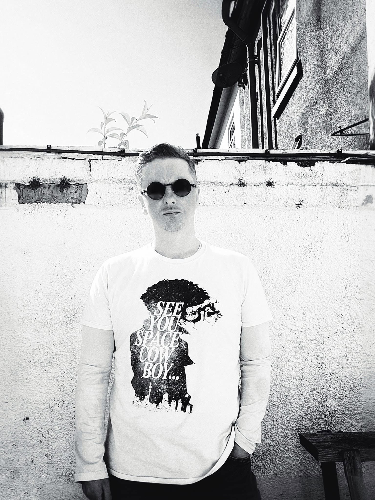
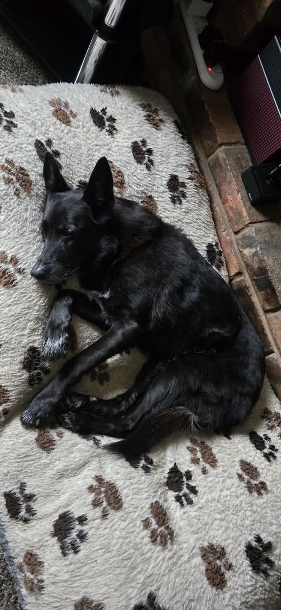
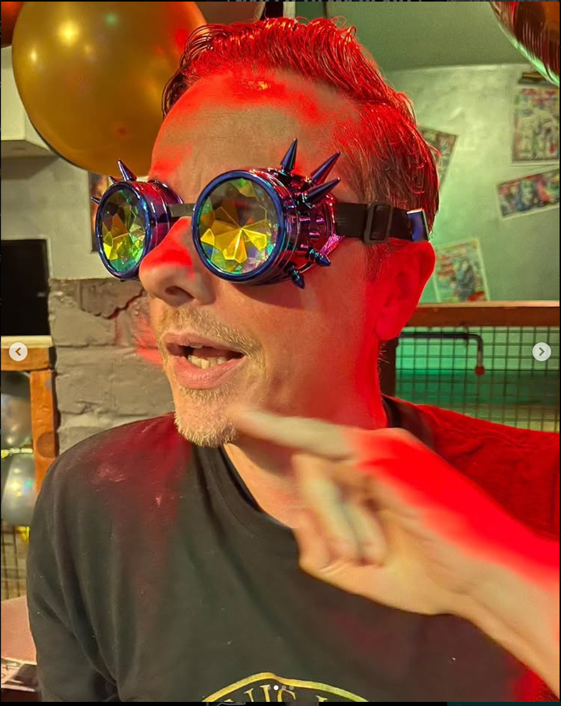

J.
