---
type:
tags:
aliases:
created: 2025-12-31
modified: 2026-01-01
date: "[[2025-12-31]]"
parent:
---
# 2025 Year in Review

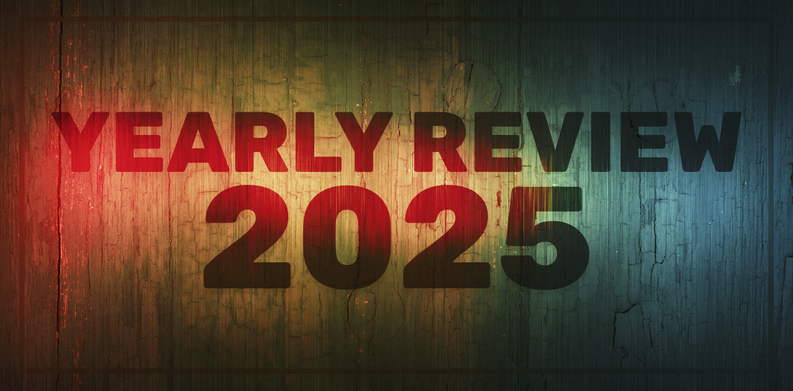

Back again for another whistle-stop tour of the last twelve months, mainly to remind myself that I haven't just been idling away my time in endless procrastination. The self-flagellation kicks in hard around this time of year as I take a break and look back at all the things I wanted to do but didn't find the time or energy for. So, in an effort to cut myself some slack, it's nice to put all my 'wins' in one place.

I've split the review up into three categories - music, academia, personal - and then added some ideas about what I'll be working on in 2026 to the end.

For a look back at what I was doing last year, check out: [[2024 Year in Review]]

## Music
- Finished and prepped _Sins_ album for release
- Released 'When the Walls Come Down'
- Released 'First We Burn'
- Artwork for all of the above
- Streams increased from 11k to 19.5k

The biggest project this year for me has been my new album, _Sins_. These are 10 tracks that I wrote back in 2019 and demoed as part of my big masters' project. As it was all written and recorded in three months, there were some rough edges, but I was proud of the songs and wanted to release them. A bit of tidying up, I thought, and they'd be good to go…

But life got in the way and other things took priority (like surviving the pandemic and then completing my PhD). Although I worked on the tracks on and off over the next 6 years it took forever to get everything boxed off and ready to share with the world. Definitely a labour of love, but I'm incredibly pleased with the results, which you'll be able to check out on Friday 16 January 2026 when _Sins_ is finally released to the world.

Pre-save and streaming links here: https://distrokid.com/hyperfollow/jamesgordon/sins

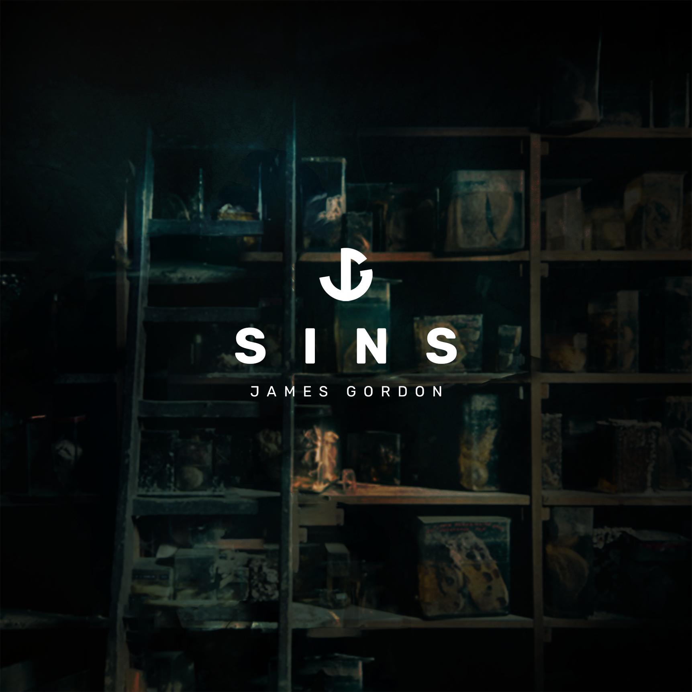
- _Sins_ album cover

As part of the album, I released two singles this year:
- [When the Walls Come Down | James Gordon](https://jamesgordon.bandcamp.com/track/when-the-walls-come-down) back in June
- [First We Burn | James Gordon](https://jamesgordon.bandcamp.com/track/first-we-burn) in October

New singles also require artwork, which I always enjoy spending time on. Here are the two I did this year:

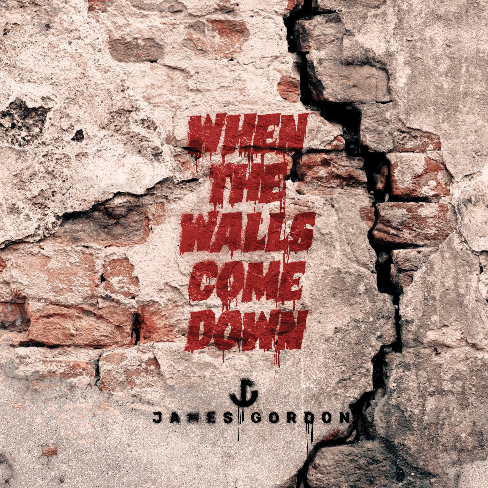
- 'When the Walls Come Down' artwork

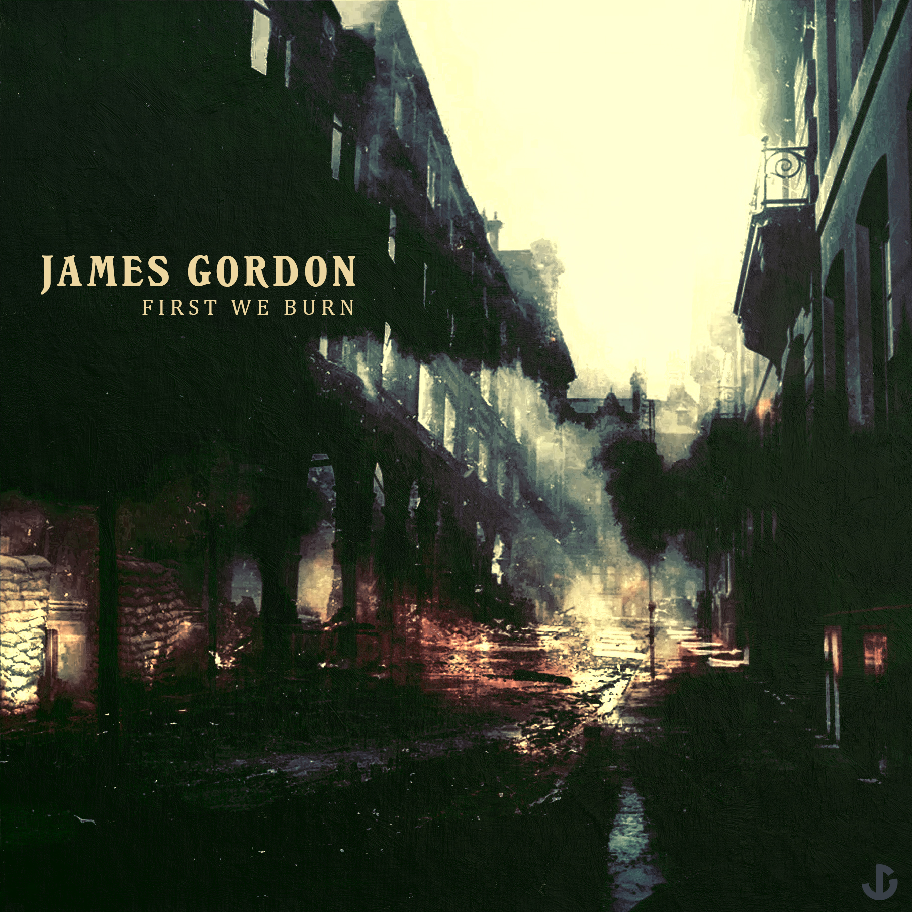
- 'First We Burn' artwork

My streaming numbers on Spotify almost doubled, which, given I haven't been particularly active promoting my work (or playing live), I was really pleased with.

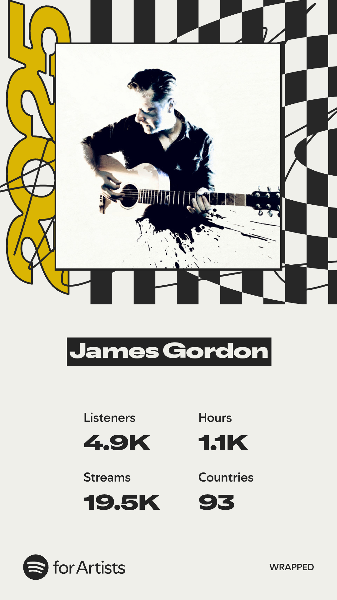
- Spotify for Artists 2025 Wrapped card

## Academia
- Completed PhD Viva, became a Doctor
- Wrote and gave a presentation on Musical Creativity at Uni of Nottingham
- Peer review work
- Started as 2nd supervisor for PhD Students

I was convinced that I was pretty much done with the whole PhD thing when I wrote my review of last year. Turns out, not so much. The _viva voce_ - an oral examination where you defend your thesis before a panel of experts - took far longer to arrange and ate up much more of my time and attention than I'd imagined it would. Luckily, my examiners were lovely and, aside from having to fix a couple of typographical errors in my thesis, I left the viva as Dr Gordon.

As I hadn't attended either my undergrad or masters' graduations, I'd promised to make an effort for this one. So, here I am, all dressed up and looking gormless in a silly hat and gown at The University of Nottingham's graduation ceremony with my Mum.

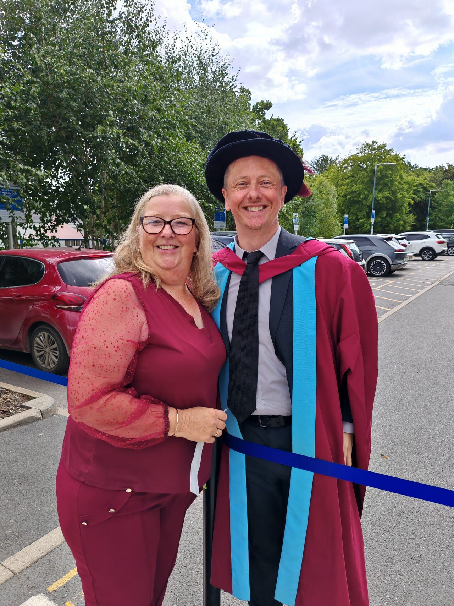

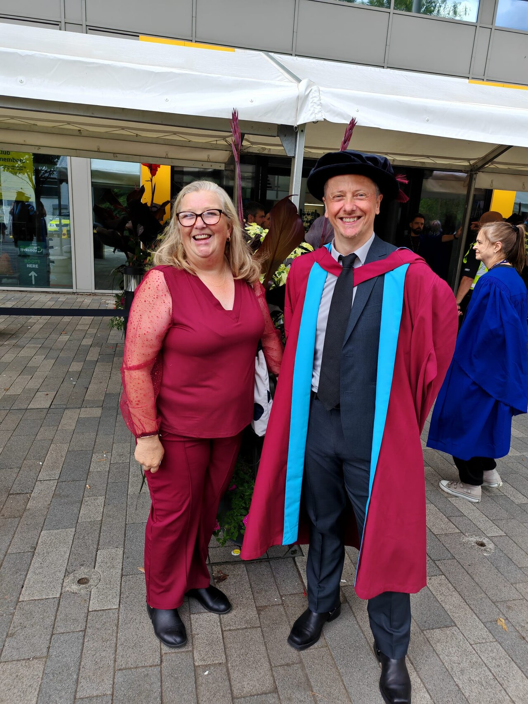
- Me in my doctoral graduation robes, celebrating with my Mum

I gave a presentation at The University of Nottingham's colloquium on Musical Creativity and Creativity Support Tools and found that I enjoyed the process of sharing my research with colleagues and students. This is something that I want to get into more in the coming year (see 'Coming in 2026' section below).

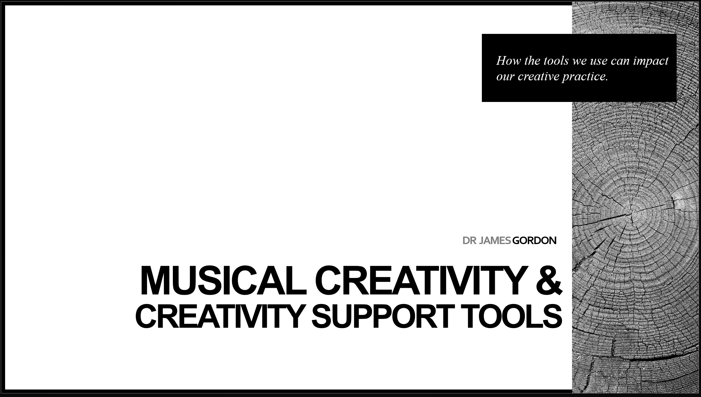
- Title card from my presentation on _Musical Creativity & Creativity Support Tools_

In amongst all of this, I did some peer review work for an academic journal and learned a lot from the process. Things that will come in handy as I start to publish some of my own work next year (again, see 'Coming in 2026' for more details).

I also started to work as a PhD Mentor and second supervisor for our new cohort of PhD students at The Academy of Music and Sound (check out: https://www.academyofmusic.ac.uk/our-courses/phd-music-sound/ for more details and a list of the talented colleagues I work with. 

My specific bio is here: https://www.academyofmusic.ac.uk/james-gordon-2/)

## Personal
- Rebuilt and refinished Ibanez Prestige RGA121 guitar
- Saw Goodison Park off and checked out Everton's new stadium
- Harley turned 15
- Miscellaneous band things

2025 turned out to be a tough old year in the end on a personal front. I dealt with some long-standing health issues, felt like a zombie for a couple of months around my birthday thanks to the drugs I was on, and wrestled with a kidney stone the size of a small moon.

Some fun things did happen though. First, I finally found time to rebuild my battered old Ibanez Prestige RGA121. Check out this full post I wrote about the process if you want more detail: [Ibanez RGA121 Rebuild Post-Mortem](https://vault.jamesgordonmusic.com/Ibanez-RGA121-Rebuild-Post-Mortem).

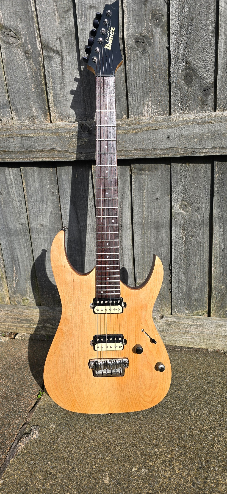

Decadence Dance - Extreme quick playthrough clip:
<iframe width="560" height="315" src="https://www.youtube.com/embed/KJlCYcAO6nE?si=Wac_Nudn-4qtQ_XX" title="YouTube video player" frameborder="0" allow="accelerometer; autoplay; clipboard-write; encrypted-media; gyroscope; picture-in-picture; web-share" referrerpolicy="strict-origin-when-cross-origin" allowfullscreen></iframe>

As a massive Evertonian, it's been a rough few years. Things seem to be looking up though. It was nice (if a bit sad) to get a chance to say goodbye to Goodison Park and then visit our fantastic new stadium on the banks of the royal blue Mersey:

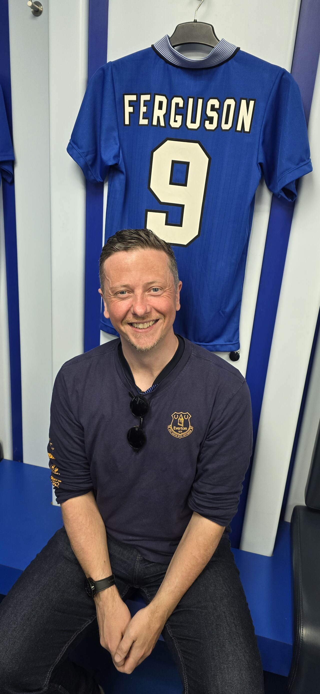
- Me sitting in the Goodison Park Home changing rooms in front of Duncan Ferguson's kit

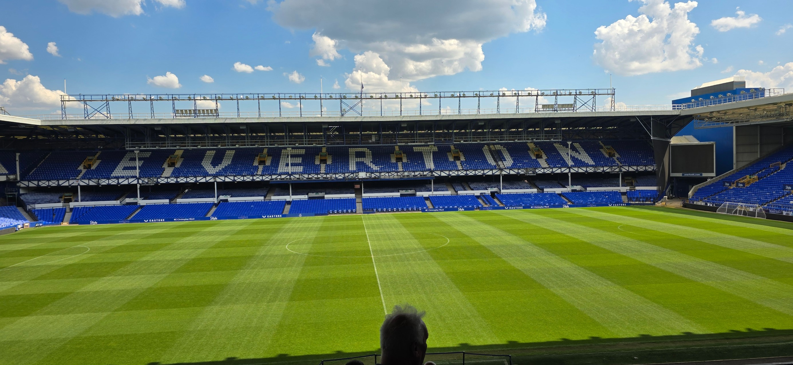
- A last photo of the Grand Old Lady

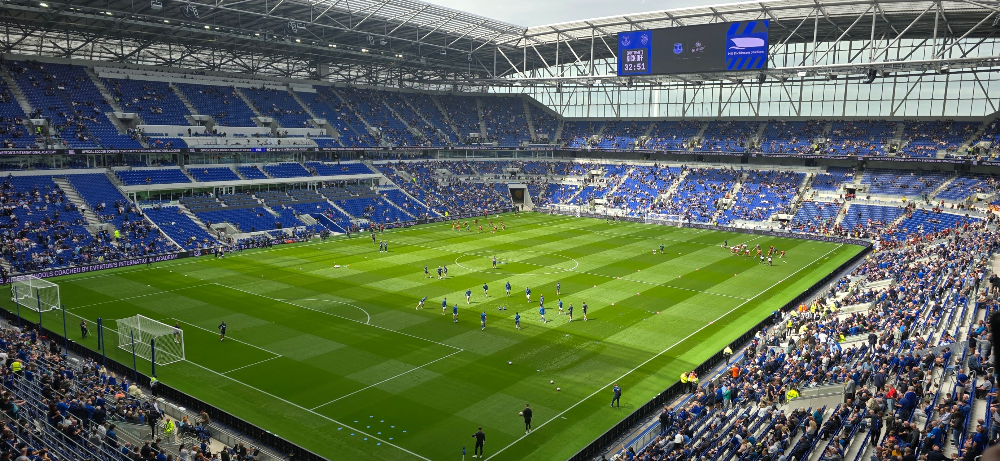
- A first photo of the phenomenal Hill Dickinson stadium

My venerable pup, Harley, turned 15 this year. Still full of beans most days, here she is trying to guilt me into giving her extra treats (which, of course, I did):

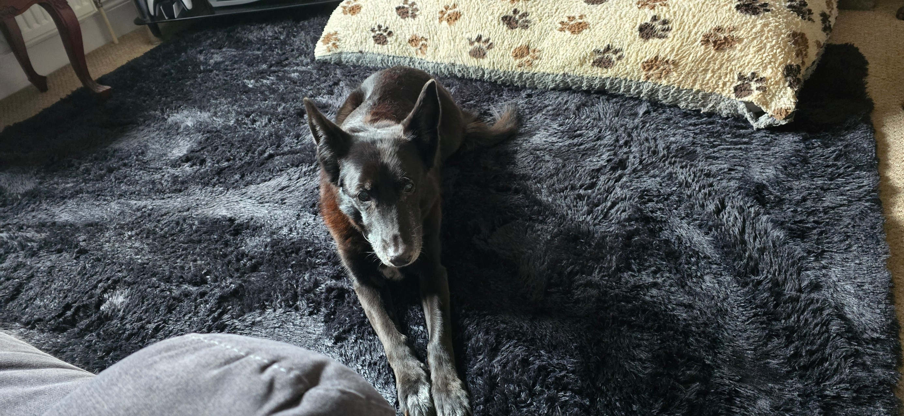
- Harley, my 15 year old Belgian Shepherd

Finally, there was a rare recent sighting of me on stage as I depped in for my old band Trollbangers on a few songs and had a whale of a time:

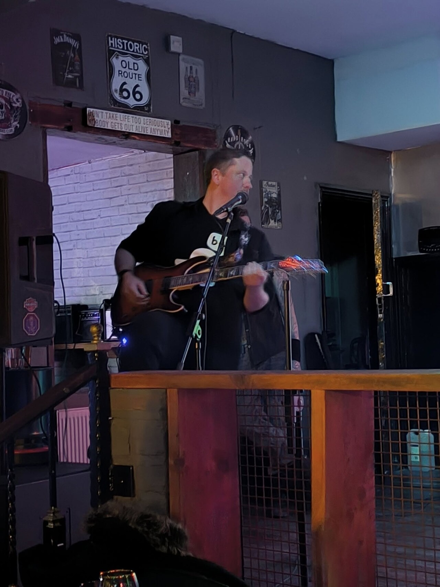
- Me on stage with the Trollbangers, trying to remember how to play

20 years ago, I was also on stage with my old band Nion Maiden (an Iron Maiden tribute band, obviously) having a blast. This clip resurfaced on Facebook this year and reminded me of how much fun I had playing live. So, not strictly something that happened in 2025, but a nice reminder of the good old days.

<iframe src="https://www.facebook.com/plugins/video.php?height=458&href=https%3A%2F%2Fwww.facebook.com%2Fjaymzgordon%2Fvideos%2F10212701256780834%2F&show_text=false&width=560&t=0" width="560" height="458" style="border:none;overflow:hidden" scrolling="no" frameborder="0" allowfullscreen="true" allow="autoplay; clipboard-write; encrypted-media; picture-in-picture; web-share" allowFullScreen="true"></iframe>

- Nion Maiden playing a snippet of 'Revelations' with some fantastic lead guitar harmony and crowd interaction

## Coming In 2026
- Book proposal
- Various academic papers, chapters, and talks
- Release PhD double album
- Covers and videos
- Band stuff
### Book Proposal
I'm in the process of refining a full proposal with Routledge to publish a version of my thesis as a monograph. Things are progressing well. I've had some early encouragement but there are no guarantees and still a tonne of work to do even at this early stage. The book would be a more accessible (and better written!) version of my thesis on Musical Creativity. This is likely to be my big project for next year, depending on how this stage pans out. 

### Academic Chapters, Papers, and Presentations
I've got some peer-reviewed writing forthcoming in various publications - including a chapter in a book - and a bunch of presentations, talks, and conferences planned for the new year. Everything is still in motion and I'm excited to share more as details get firmed up.

### PhD Double Album
Once _Sins_ has been released (January 16th), I'll be turning my attention to the double album I wrote and recorded as part of my PhD. This is pretty much finished, barring some mastering. I want to add back two or three tracks that I had to remove from the PhD submission due to time constraints and I also want to release some of the songs as singles, so I'll be aiming for a summer release of the two albums, I think.

### Covers & Videos
I've got a mini-album/EP'ss worth of covers and videos that I want to record if I get some time. The amount of work required means that I've been putting this stuff on the back burner but I do enjoy it so, hopefully, this year I'll be able to carve out some time to work on them. No guarantees though.

### Band Stuff
Best laid plans went awry last year and, again, I'm pushed for free time this year. But I do miss being on stage and being part of a band, so will be looking to get back at it in 2026.

### Other Albums / Music Releases / Projects
I mentioned a couple of possible projects in last year's review and just ran out of time. There are a bunch of ideas and works-in-progress that I would love to get back to but it's not looking likely this year either. Once the PhD albums are released, I'll no doubt be looking at writing some new stuff in the second half of the year though.

The same is true of the new YouTube channel and blog plans. They are on hold for the moment, though I have some good ideas that I want to start putting out there. If my time opens up, then I'd love to get to this in 2026.

## Conclusion
If you've read this far, thanks for taking the time. Feel free to leave a comment if you're interested in hearing further details about any of this stuff. I write these to remind myself that I'm not just whiling away my hours doing nothing. It's nice to look back on the things I have managed to get done amongst the chaos of every day life but it's always fun to hear what other people think, hence me making them public. 

See you next year.

