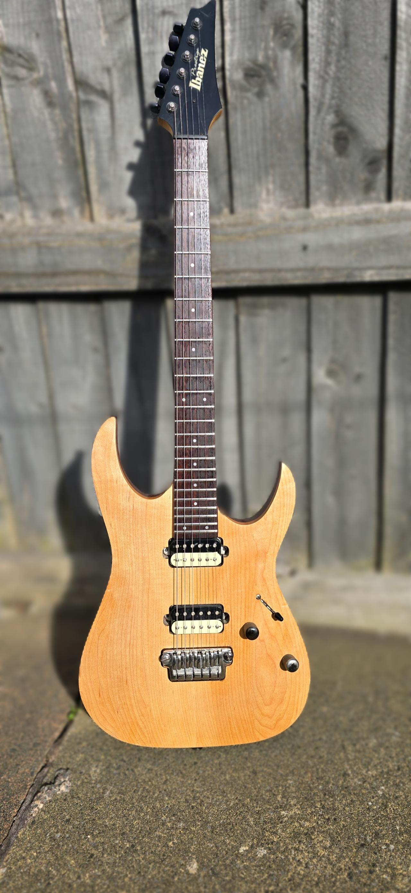
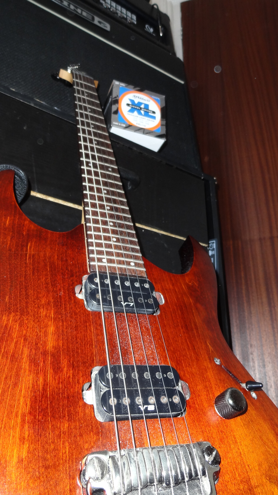
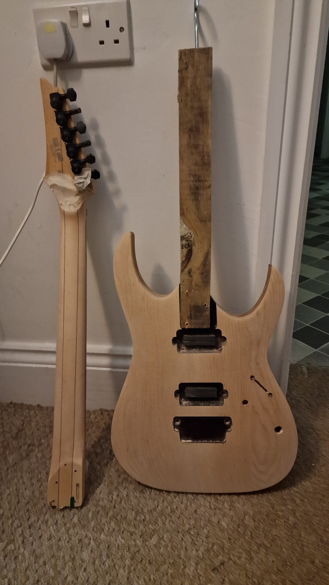
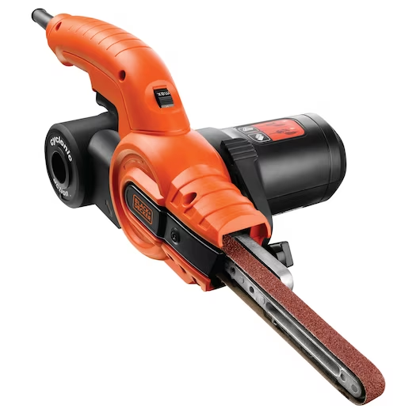
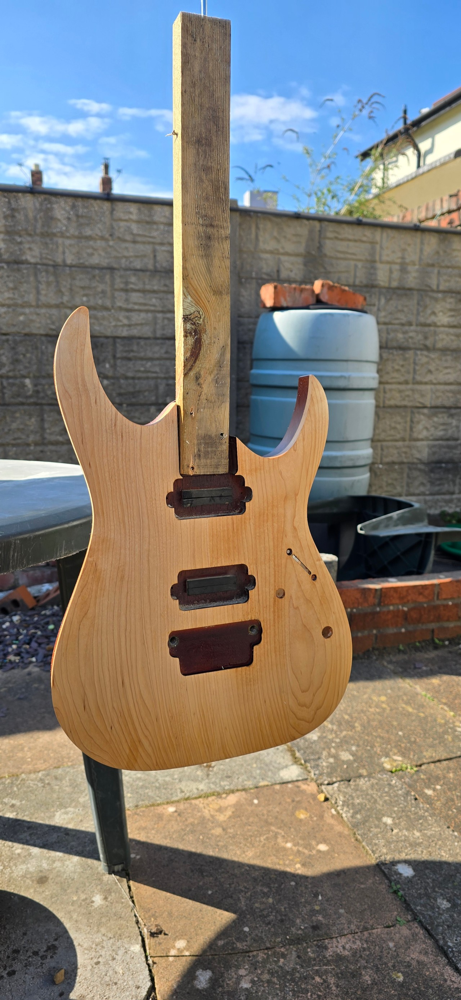
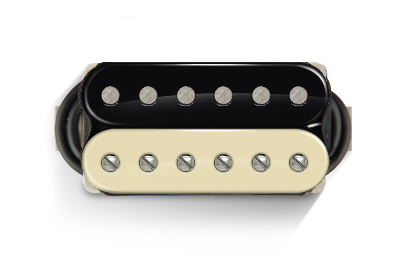
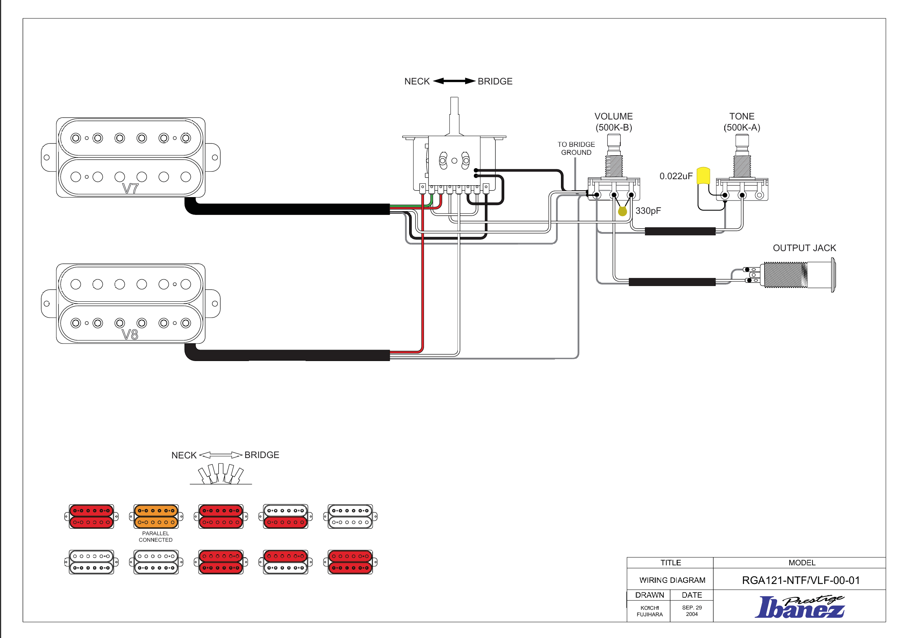
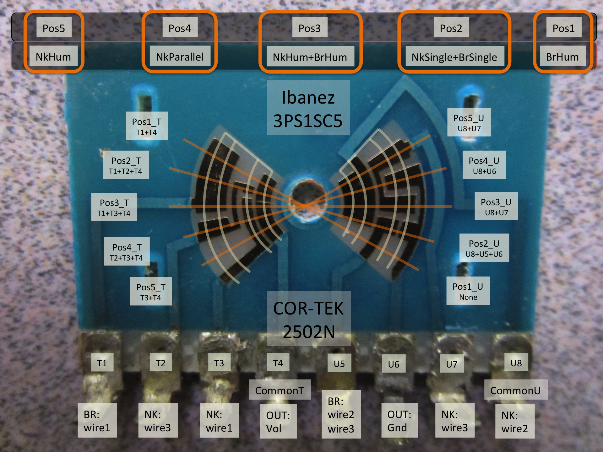
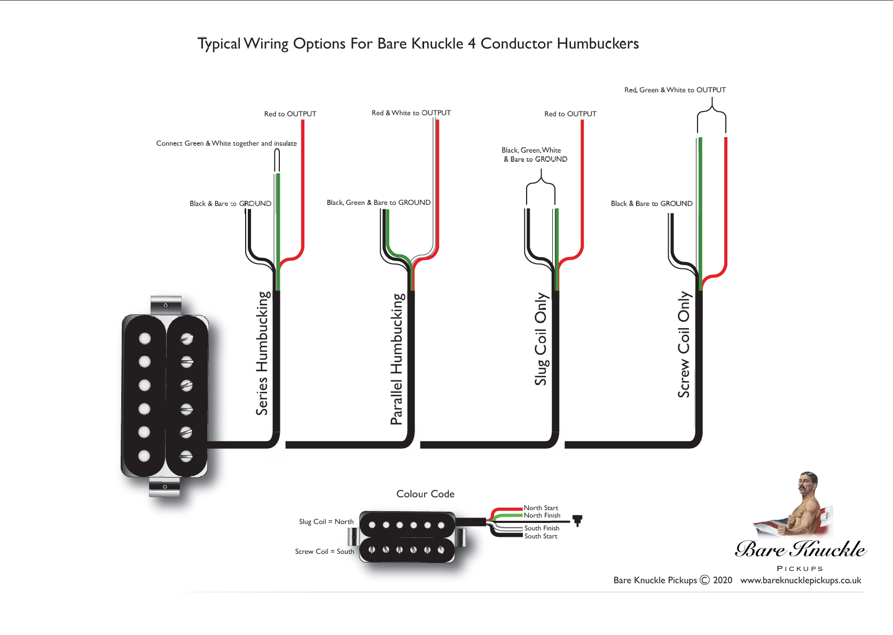
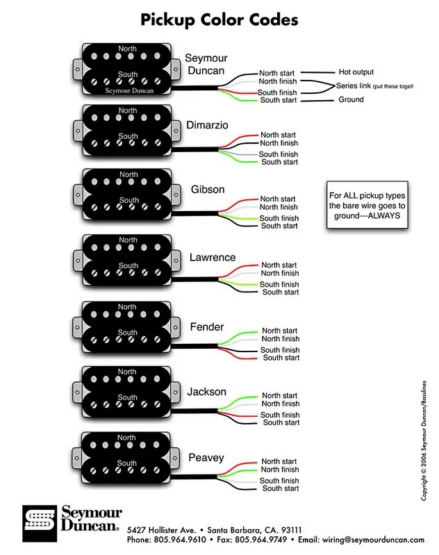

# Ibanez RGA121 Rebuild Post-Mortem
My most recent project has been a rebuild of one of my battered-and-bruised old gigging guitars and I wanted to put together a little post-mortem of the project and capture everything I learned along the way in case I ever need it in the future. Maybe others will find pieces of it useful too. 

I also want to get into the habit of reflecting on projects in a more concrete way once they're done as such reflexivity a vital part of how we develop our skills and improve the things we make and do.

I'm a bumbling amateur when it comes to this type of thing (guitar maintenance, refinishing, woodwork, electronics, setups, etc.) but I had fun putting this together.

Here's a quick look at the finished guitar:

Decadence Dance - Extreme quick playthrough clip:
https://youtu.be/KJlCYcAO6nE

## History
I bought this beautiful Ibanez RGA121 fifteen years ago and played it all over the country with a bunch of bands (and even on a few gigs in Europe), it was my main instrument for a lot of the later [Head 13](https://head13.bandcamp.com/) stuff.

'No Excuse' video: https://youtu.be/cod1Y1r0bo0?si=anhrZhq96SV4G5Nn
Guitar solo from 'Skulduggery': https://youtu.be/0Exx4mGYczk?si=KzR17fEqnR4SVIwc

Along the way it got a little banged up and the 'violin' finish it came with started to look tatty. Add to that, the wiring job I did when I first installed the new pickups not being great, a chunk taken out of the fretboard courtesy of my clumsiness, plus some very worn frets, and the whole guitar was in need of some TLC.

Over the years, I'd occasionally seen other versions of the RGA121 in 'natural' finish and been a little jealous of how pretty it looked. I figured now was as good a time as any to strip the 121 back to bare wood and tidy everything up.

## Specs
[RGA121 | Ibanez Wiki | Fandom](https://ibanez.fandom.com/wiki/RGA121#Specifications)
Ibanez Prestige RGA121 VLF (violin flat) [2005]

(original specs)

_Body_: Arched-top, mahogany body with maple top
_Neck_: Wizard Prestige neck (AANJ, 5-piece maple/walnut), 24 fret, rosewood fingerboard, small dot position markers
_Pickups_: HH, Ibanez V8/V7 (four conductor wiring)
_Bridge_: Gibraltar Plus fixed bridge
_Scale Length_: 25.5"
_Machine Heads/Tuners_: Gotoh SG381

(upgraded specs)

_Finish_: Natural oil finish (Crimson Guitars Penetrating Oil and then High-Build Oil)
_Pickups_: HH, Bare Knuckle Nailbombs (matched set, zebra bobbins)
_Machine Heads/Tuners_: Sperzel Trim-Lok

## Stripping it Back
My plan was to sand the scuffed and scratched violin finish back to bare wood and see how it looked before deciding on my next move. I wasn't sure how nice the maple top would be. Why would they cover it up if it was pretty?

I needn't have worried, the maple top looked fantastic once it had been revealed.

The original finish was thicker than expected and took a a fair bit of elbow grease to remove. I'd just bought a finger sander (the Black+Decker [Powerfile](https://www.blackanddecker.co.uk/product/ka900e-gb/powerfile-electric-belt-sander-3-accessories-350w) in case you're interested) for another project and thought I might be able to use it to help with this. Turns out… not so much.

_Lessons_: 
- Use the right tool for the job 
- Don't change your approach if it's already working

The finger sander caused more work for me in the long run as it gouged away too much material away no matter how careful I was. Smoothing out the resulting mess by hand took longer than just doing it by hand in the first place.

I sanded the body and back of the neck to 320 grit then got distracted by other stuff… for 2 years!

## Refinishing
After attempting something similar once before (nearly 20 years ago on an Ibanez RG548) with nitrocellulose lacquer and making a million mistakes (have I mentioned that I really don't know what I'm doing?), I wanted a simpler finish this time that would still look nice.

I saw a few videos from [Crimson Guitars](https://www.crimsonguitars.com/) (specifically, this one: https://youtu.be/qIWN5WwrVzI?si=PqPIpwnSK-hmanFT&t=1069) where they used an oil finish that looked both fantastic and easy to apply, so I ordered some of their:
- [Penetrating Guitar Finishing Oil](https://www.crimsonguitars.com/products/penetrating-guitar-finishing-oil?_pos=1&_sid=3921456b1&_ss=r)
- [High Build Guitar Finishing Oil](https://www.crimsonguitars.com/products/high-build-guitar-finishing-oil?_pos=2&_sid=3921456b1&_ss=r)

Applying the oil was simple enough. First a few coats of the Penetrating (with time to dry in between) and then a few of the High Build.

I did the same to the neck, though stuck with just the penetrating oil for that as I wanted it to feel natural in my hand (I dislike heavy finishes on guitar necks as they often feel sticky, especially when sweating on stage).

I was really pleased with how it turned out:

## Fret Dress
The battering the guitar had taken at gigs and from my heavy-handed playing over the years meant the frets had a bunch flat spots and dents that needed to be taken care of. Having spent a tonne of money getting fret work done over the years, I pushed myself during the Covid lockdown to learn how to do it myself.

I'd picked up a few tools here and there (again, mostly from Crimson, their [Essential Fret Levelling and Dressing Tool Kit](https://www.crimsonguitars.com/products/copy-of-essential-fret-levelling-and-dressing-toolkit?_pos=2&_sid=53af7411e&_ss=r) has many of them in a nice bundle, though I also like the [H-FF3 : HOSCO Fret Crown file](https://www.hosco.co.jp/en/tools/by-use/woodwork/file/h-ff3.html)) and have done a practice run or two on some of my other guitars, but this was the first proper fret level, crown, and polish I'd tried.

Definitely one of the scariest parts of the job for a beginner like me, but it turned out great. No flat spots, I didn't set anything on fire or put myself in the hospital, so I'm counting that as a win!

## Pickups & Wiring
Back when I was gigging this thing in a heavy rock band, I upgraded the old V7/V8 pickups for a matched set high output [Bare Knuckle Nailbomb Pickups](https://www.bareknucklepickups.co.uk/pickup/humbucker/nailbomb) (with the ceramic bridge magnet option). I also swapped out the switch hoping to get more tonal options out of guitar: 

However, the new super switch I ordered barely fit into the shallow depth of the control cavity (the guitar is fairly thin, though ridiculously heavy despite that!). That, plus my shonky soldering led to a host of issues that required constant fiddling, caused occasional cut-outs in the sound, and ultimately left me dissatisfied with the instrument and unsure if I could trust it for live work anymore.

And so it sat, for years, unused.

Occasionally, I would pull it out and remember how much I enjoyed playing it. Such as when I attempted to learn 'Scarified' by Paul Gilbert/Racer X on it back in 2017: https://youtu.be/AkPsq2x9Y74?si=TdxEjHLt_m8EHSe8

In order to bring the beast back to life I decided to redo the wiring to return it to as close to the way as it came out of the factory as I could.

I tracked down the original wiring diagram for the guitar (courtesy of this [post](https://www.jemsite.com/threads/pickup-wiring-on-rga121.45138/) over on the Ibanez JEM Forum):

And dug out the original Cor-Tek 2502n switch from my parts pot. 

Turns out the switch has some unusual configurations ("non-standard workings" as someone puts it on this [forum post](https://forum.seymourduncan.com/forum/the-pickup-lounge/331967-please-help-me-wire-this-2502n-ibanez-style-switch)).

Cor-Tek Switch Diagram:

- The "wire 1", "wire 2"… labelling above tripped me up. To make this line up with the pickup manufacturer wiring diagrams below, a little research and translation was in order. Here's what I landed on:
	- Wire 1 = North Start
	- Wire 2 = North Finish
	- Wire 3 = South Finish
	- Wire 4 = South Start

### Mistakes
And here's were a fresh batch of mistakes were made.

_Lesson_: Don't assume, check.

Turns out my assumption that pickup manufacturers would use a standard for colour-coding their wires was wildly wrong. I should have remembered this from the last time I wired this up, but Bare Knuckle and Ibanez are definitely not the same.

Bare Knuckle wiring:

Everyone else's wiring:

So, after a couple of failed attempts, here's the wiring chart I used to make everything line up:
- Ibanez V7/V8
	- Wire 1 = North Start = Red
	- Wire 2 = North Finish = Black
	- Wire 3 = South Finish = Green
	- Wire 4 = South Start = White

- Bare Knuckle
	- Wire 1 = North Start = Red
	- Wire 2 = North Finish = Green
	- Wire 3 = South Finish = White
	- Wire 4 = South Start = Black

- Translation for the Ibanez Wiring Diagram above (V7/V8 to Bare Knuckle)
	- Red = Red
	- Black = Green
	- Green = White
	- White = Black

## Conclusion
This was a project that was out of my comfort zone. From woodwork to fret dressing to pickup wiring, I am very much a lost beginner. That being said, I'm incredibly pleased with how the guitar turned out. It went from an instrument that sat unused and unloved in my spare room to one that makes me want to play it every time I look at it.

I learned a bunch of things (mainly about being impatient and making assumptions, lessons I keep having to relearn in many painful permutations) and am glad I finally got it finished after so long.